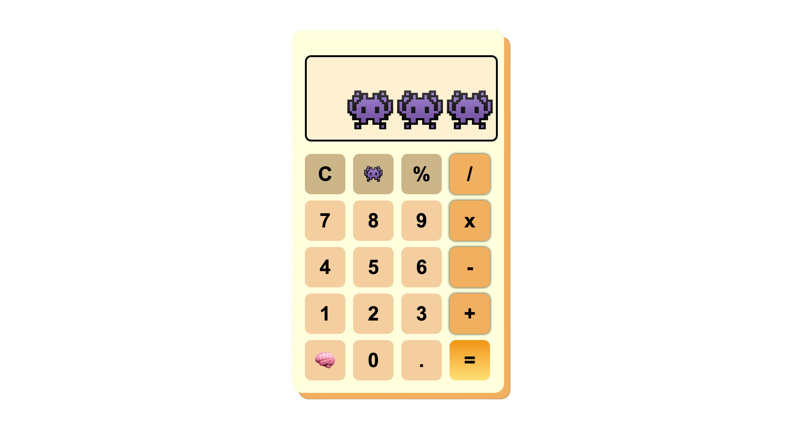

# 🧮 Simple Calculator

Welcome to the **Simple Calculator**! A minimalistic and easy-to-use tool to perform basic operations.

## Features:
- **Addition** ➕
- **Subtraction** ➖
- **Multiplication** ✖️
- **Division** ➗

## How to use:
1. Enter two numbers.
2. Choose an operation.
3. Get the result!

## Example:

- **5 + 3 = 8**
- **9 - 4 = 5**
- **6 ✖️ 2 = 12**
- **8 ➗ 2 = 4**

Enjoy calculating! ✨
